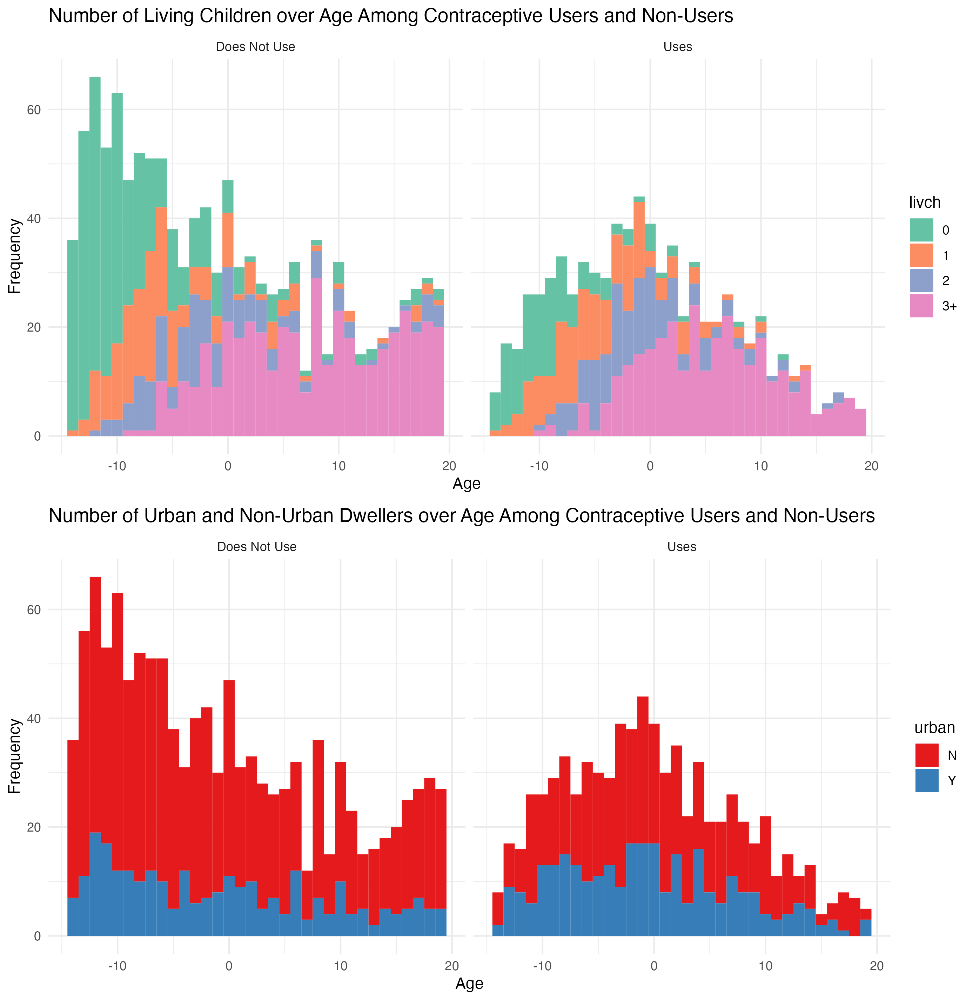
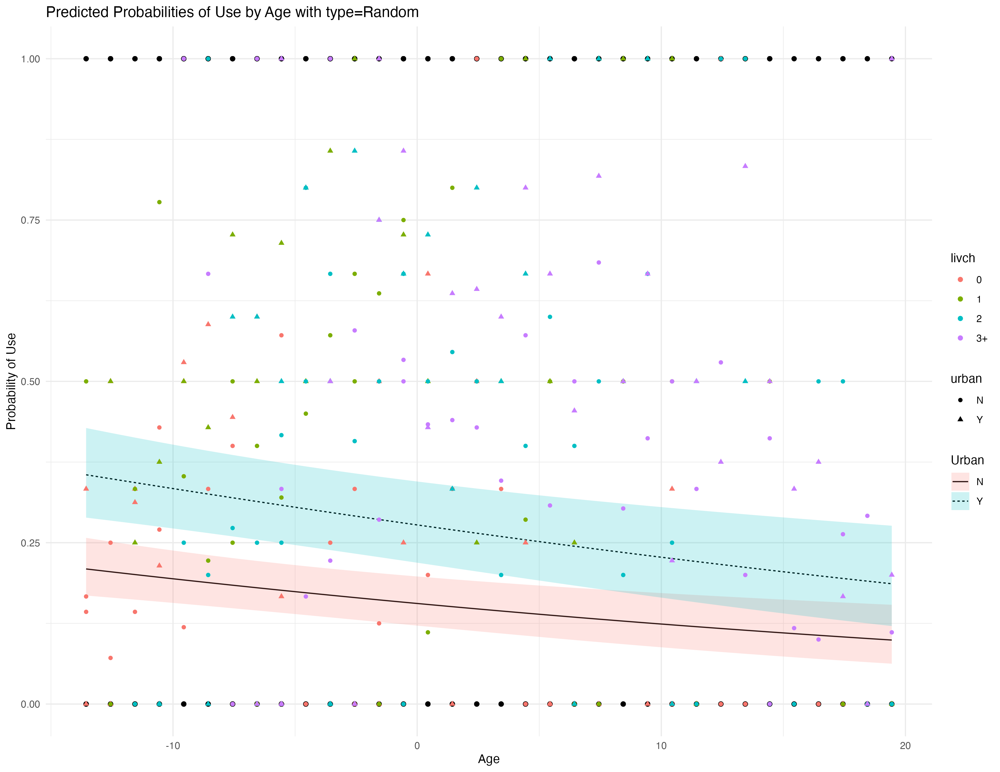

```{r, warning = FALSE, message = FALSE, echo = FALSE}
library(tidyverse)
library(lme4)
library(performance)
library(ggeffects)
library(glmmTMB)
library(knitr)
library(gridExtra)
library(DHARMa)
library(brms)
library(rstanarm)
library(bayesplot)
library(bayestestR)
```

```{r, echo = FALSE}
data("nepali", package = "faraway")
data <- dplyr::select(nepali, -ht)
data$sex <- factor(data$sex, levels = c(1, 2), labels = c("male", "female")) # convert sex to factor

# Extract panchayat and ward  from Id and create new factor
data$panchayat <- as.factor(substr(data$id, 1, 2))
```

**1**

```{r, echo = FALSE, warning= FALSE}

ggplot(data, aes(x = age, y = wt, shape = factor(sex), color = panchayat)) +
  geom_point() +
  labs(title = "Child Weight by Age and Sex",
       x = "Age (months)",
       y = "Weight (kg)",
       color = "Panchayat",
       shape = "Sex") +
  theme_minimal() 

```

We started with a standard linear regression model using various predictors. This model showed a good fit (R-squared = 0.7843), but we found that the variables `died` (number of children who died) and `alive` (number of living children) weren't statistically significant. We then adjusted our approach by considering the `panchayat` variable, which represents different regional groups with possibly unique socioeconomic and cultural characteristics. This variable, extracted from the `id` field and treated as a factor with three levels, was included in our new model. This improved our model's fit (R-squared increased to 0.8053). Interestingly, the significance of died and alive improved, with p-values dropping to 0.0101 and 0.00012, respectively. Next, we moved to a mixed effects model using `lme4::lmer`, treating `panchayat` as a random intercept. Our goal was to capture variations across the three panchayats.  We experimented with random slopes for different predictors, but only the model with `mage` (mother's age) as a random slope showed improvement (2.1% decrease in REML score). This model suggested variability in mother's age impact across regions. Using `performance::check_model`, we evaluated the mixed effects models. The diagnostic plots for both models were similar, showing a significant deviation in the tails of the residuals. The QQ plot indicated issues with the normality of residuals, consistent with the earlier linear regression models. Initially, we leaned towards the mixed effects model with the random effects term `(panchayat|mage)`. However, after further analysis using `ggeffects::ggpredict` and considering the observed data, we concluded that the model without the random slope for mother's age was more realistic. This decision was supported by an LRT test favoring this simpler model. Additionally, removing `died` from the model further improved its fit.

The final model suggests significant variability in baseline child weight across different panchayats. The residual variance of 1.710 indicates that the model doesn't fully explain the variation in child weight. Literate mothers are associated with an estimated increase of 1.038kg in child weight compared to non-literate mothers. Each additional living child is linked with a decrease in weight by approximately 0.113kg. Each additional year in the mother's age correlates with an estimated weight increase of 0.071 kg in children. This analysis indicates that mother's literacy and the number of living children have a notable impact on child weight, alongside variations linked to different panchayats. 

```{r, echo = FALSE}
# Linear Regression Model
#model0 <- lm(wt ~ age + sex + lit + died + alive + mage +panchayat, data = data)
# summary(model0)
# check_model(model0)

# Mixed effects model with random intercepts for panchayat.
 model1 <- lmer(wt ~ age + sex + lit + alive + mage + (1|panchayat) , data = data)
 model2 <- lmer(wt ~ age + sex + lit + alive + mage + died + (1|panchayat) , data = data)
 model3 <- lmer(wt ~ age + sex + lit + alive + mage + died + (panchayat| mage), data = data)
 summary(model2)
 
 lrt_result <- anova(model1, model2)
 #lrt_result <- anova(model2, model3)
 #lrt_result

# Mixed effects model with random intercepts for panchayat and random slope for mothers age. 
# model2 <- lmer(wt ~ age + sex + lit + died  + alive + mage + (panchayat|mage) , data = data)
# summary(model2)
# check_model(model2)
```
\newpage
```{r, echo = FALSE, warning = FALSE, fig.height= 15, fig.width = 8, fig.align='center', message = FALSE}
 check_model(model2)
```


```{r, echo = FALSE}
# Generate predictions from model along with confidence intervals
preds <- ggpredict(model1, terms = c("age", "panchayat"), type = "random")
pp <-plot(preds)

# Create the base plot with original data
base_plot <- ggplot(data, aes(x = age, y = wt, color = panchayat)) +
    geom_point(alpha = 0.6) 

# Add the prediction layers to the base plot
final_plot <- base_plot +
    geom_line(data = preds, aes(x = x, y = predicted, color = group)) +  
    geom_ribbon(data = preds, aes(x = x, ymin = conf.low, ymax = conf.high, fill = group), alpha = 0.2,inherit.aes = FALSE ) + 
    theme_minimal() +
    labs(title = "Weight by Age with Model Predictions", x = "Age", y = "Weight")

# Plot the final combined plot
final_plot

```


The paper by West et al describes a double-masked, randomized, placebo-controlled community trial assessing the impact of high-potency vitamin A supplementation on the growth of preschool-aged children in Nepal. This design involves a direct intervention (vitamin A supplementation) and a control group. The study employed chi-square tests for categorical variables and analysis of variance for continuous variables to evaluate baseline group differences.  Growth increments were compared using linear regression, adjusted for age, baseline values, and sex. The regression analysis also considered arm circumference as an effect modifier. The analysis was stratified by initial arm circumference to account for children who were wasted and not wasted at the outset.

Our approach involved using a linear mixed effects model with the formula `wt ~ age + sex + lit + died + alive + mage + (1|panchayat)`, applied to the `faraway::nepali` dataset. This model focused Focuses on exploring the relationship between various predictors and child weight. We included a random effect for panchayat to account for variability across different panchayats.

The paper's method is based on a controlled trial with a specific intervention (vitamin A supplementation), whereas our approach is more observational, exploring relationships without a specific intervention. The paper's study involves randomization and control groups whereas our approach does not involve these elements. The paper focuses on growth impacts (with measurements taken periodically) in the context of a vitamin A intervention, whereas our model looks at weight in relation to various predictors. 


**2**
We fit a linear model with a logit link function to analyze a binary outcome. Specifically, we used the `lme4::glmer` function to construct two models incorporating random effects. The first model included a random intercept based on the urban or rural status of districts. The second model extended this by adding a random slope for the urban classification of districts.
Upon comparing these models using a Likelihood Ratio Test (LRT), we found that the model with both random intercept and slope for the urban variable `(urban | district)` demonstrated superior fit. This was evidenced by lower values in Akaike Information Criterion (AIC), log-likelihood, and deviance, although it had a slightly higher Bayesian Information Criterion (BIC). The Chi-square test revealed a significant improvement with this model (p-value = 0.0006759), leading us to adopt the formula `use ~ age + livch + age + urban + (urban | district)` for our final model.
We then assessed the model's fit using the `performance::check_mode`l function, which indicated a generally good fit but highlighted some unusual patterns in the residuals. To further investigate, we applied the dHARMa package, leading to the residual plot provided below. This plot confirms that the residuals of our chosen model are appropriately distributed.
Regarding the model coefficients, the `age` coefficient is -0.026518, indicating that with each additional year of age, the log odds of using contraception decreases. The coefficients for the number of living children (`livch`) are all positive and exceed 1. This suggests that having one, two, or more than three living children significantly increases the likelihood of contraception use compared to having no living children. Lastly, the coefficient for `urban` (0.815146) implies that residing in an urban area, as opposed to a non-urban one, increases the odds of contraception use.


```{r, echo = FALSE}
data("Contraception", package = "mlmRev")
```

```{r, echo = FALSE}
Contraception$use_label <- factor(Contraception$use, levels = c(0, 1), labels = c("Does Not Use", "Uses"))

# Histogram for 'livch' distribution
hist_livch <- ggplot(Contraception, aes(x = age, fill = livch)) +
  geom_histogram(position = "stack", binwidth = 1) + 
  facet_grid(~ use_label) +
  labs(x = "Age", y = "Frequency", title = "Number of Living Children over Age Among Contraceptive Users and Non-Users") +
  scale_fill_brewer(palette = "Set2") + 
  theme_minimal()

# Histogram for 'urban' distribution
hist_urban <- ggplot(Contraception, aes(x = age, fill = urban)) +
  geom_histogram(position = "stack", binwidth = 1) +
  facet_grid(~ use_label) +
  labs(x = "Age", y = "Frequency", title = "Number of Urban and Non-Urban Dwellers over Age Among Contraceptive Users and Non-Users") +
  scale_fill_brewer(palette = "Set1") +
  theme_minimal()

# Arrange the two plots
# p2 <- grid.arrange(hist_livch, hist_urban, nrow = 2)

```




```{r, echo = FALSE}
mod0 <- glmer(use ~ age + livch + age + urban + (1| district), data = Contraception, family = binomial)
mod1 <- glmer(use ~ age + livch + age + urban + (urban | district), data = Contraception, family = binomial)

summary(mod1)


lrt_result <- anova(mod0, mod1)
#summary(lrt_result)
```
\newpage

```{r, echo = FALSE, warning = FALSE, fig.height= 15, fig.width = 8, fig.align='center', message = FALSE}
check_model(mod1)
```

```{r, echo  = FALSE, message = FALSE}
DHARMa::plotSimulatedResiduals(simulateResiduals(mod1))
```

```{r, echo = FALSE, warning = FALSE, message = FALSE}
# Generate predictions
pp0 <- ggpredict(mod1, terms = c("age [all]", "urban"), type = "random")

# Base plot with original data
base_plot <- ggplot(Contraception, aes(x = age, y = use)) +
    geom_point(alpha = 0.6) 

# Overlay predictions and confidence intervals
final_plot0 <- base_plot +
    geom_line(data = pp0, aes(x = x, y = predicted, linetype = group), inherit.aes = FALSE) +  
    geom_ribbon(data = pp0, aes(x = x, ymin = conf.low, ymax = conf.high, fill = group), alpha = 0.2, inherit.aes = FALSE) + 
    theme_minimal() +
    labs(title = "Predicted Probabilities of Use by Age", x = "Age", y = "Probability of Use") +
    scale_linetype_discrete(name = "Urban") + 
    scale_fill_discrete(name = "Urban") +
     stat_summary(data = Contraception,
               aes(x = age, y = use, colour = livch, shape = urban),
               fill = NA,
               geom = "point",
               fun = mean)


pp1 <- ggpredict(mod1, terms = c("age [all]", "urban"))

final_plot1 <- base_plot +
    geom_line(data = pp1, aes(x = x, y = predicted, linetype = group), inherit.aes = FALSE) +  
    geom_ribbon(data = pp1, aes(x = x, ymin = conf.low, ymax = conf.high, fill = group), alpha = 0.2, inherit.aes = FALSE) + 
    theme_minimal() +
    labs(title = "Predicted Probabilities of Use by Age with type=Random", x = "Age", y = "Probability of Use") +
    scale_linetype_discrete(name = "Urban") + 
    scale_fill_discrete(name = "Urban") +
    stat_summary(data = Contraception,
               aes(x = age, y = use, colour = livch, shape = urban),
               fill = NA,
               geom = "point",
               fun = mean)
    
```

\newpage



```{r, echo = FALSE, warning = FALSE, message = FALSE}
# Fit the completely pooled analysis model (glm)
model_glm <- glm(use ~ age + livch + urban, data = Contraception, family = binomial)

  # Extract fixewd effects from glm model 
  summary_glm <- summary(model_glm)
  fixed_effects_glm <- summary_glm$coefficients
  df_glm <- data.frame(term = rownames(fixed_effects_glm),
                     estimate = fixed_effects_glm[, "Estimate"],
                     std.error = fixed_effects_glm[, "Std. Error"])
  df_glm$model <- "GLM"
  

# Fit the penalized quasi-likelihood model (glmmPQL)
model_glmmPQL <- MASS::glmmPQL(use ~ age + livch + urban, random = ~ 1 | district, family = binomial, data = Contraception)

  # Extract fixed effects from glmmPQL model
  summary_glmmPQL <- summary(model_glmmPQL)
  fixed_effects_glmmPQL <- summary_glmmPQL$tTable
  df_glmmPQL <- data.frame(term = rownames(fixed_effects_glmmPQL),
                           estimate = fixed_effects_glmmPQL[, "Value"],
                           std.error = fixed_effects_glmmPQL[, "Std.Error"])
  df_glmmPQL$model <- "glmmPQL"

# Fit the Laplace approximation model (glmer)
model_glmer <- glmer(use ~ age + livch + urban + (1 | district), data = Contraception, family = binomial)

  # Extract fixed effects from glmer model
  summary_glmer <- summary(model_glmer)
  fixed_effects_glmer <- summary_glmer$coefficients
  df_glmer <- data.frame(term = rownames(fixed_effects_glmer),
                         estimate = fixed_effects_glmer[, "Estimate"],
                         std.error = fixed_effects_glmer[, "Std. Error"])
  df_glmer$model <- "GLMER (Laplace)"

# Fit the adaptive Gauss-Hermite quadrature model (glmer with nAGQ = 20)
model_glmer_nAGQ <- glmer(use ~ age + livch + urban + (1 | district), data = Contraception, family = binomial, nAGQ = 20)

  #Extract fixed effects from glmer model with nAGQ=20
  summary_glmer_nAGQ <- summary(model_glmer_nAGQ)
  fixed_effects_glmer_nAGQ <- summary_glmer_nAGQ$coefficients
  df_glmer_nAGQ <- data.frame(term = rownames(fixed_effects_glmer_nAGQ),
                              estimate = fixed_effects_glmer_nAGQ[, "Estimate"],
                              std.error = fixed_effects_glmer_nAGQ[, "Std. Error"])
  df_glmer_nAGQ$model <- "GLMER (nAGQ=20)"


# Combine data
coefficients_df <- rbind(df_glm, df_glmmPQL, df_glmer, df_glmer_nAGQ)

# Create the coefficient plot
ggplot(coefficients_df, aes(x = estimate, y = term, color = model)) +
  geom_point(position = position_jitter(width = 0.02, height = 0), size = 2.5) +
  labs(x = "Coefficient Estimate", y = "Term", title = "Comparison of Fixed-Effect Parameters") +
  theme_minimal() +
  theme(legend.position = "bottom")


```

The research paper by Ng et al. focuses on estimating generalized linear mixed models, specifically those with binary outcomes. The main challenge addressed in the paper is the difficulty in obtaining an analytical solution for the likelihood of a discrete response. This issue is significant because it can lead to bias in the results obtained through marginal and penalized quasi-likelihood methods.
To explore this problem, the authors the a dataset referred to as "BANG." They applied several modeling techniques to this dataset, including Second Order PQL (PQL_2), SML (Sequential Monte Carlo), EM_Laplace2, MCMC (Markov Chain Monte Carlo), as well as numerical quadrature methods implemented through Proc_NLMIXED and GLLAMM.
They used the same model formula as our analysis. This approach allows for the examination of variations in variances across different districts, particularly between rural and urban areas. Secondly, it provides a basis for comparison with the `lme4::glmer` function used in our analysis, which employs a Laplace approximation method.
When comparing the coefficient estimates from our model to those from the EM_Laplace2 model used in the Ng et al. paper, we find that the values are somewhat similar. The differences in the fixed effects parameters across these two models are minimal, with discrepancies of at most $10^{-2}$. 

# 3
We fit the same mode formula as in q2 with the Contraception data set using two bayesian methods: `brms::brm` and `rstanarm::stan_glmer`. All parameter estimates has sufficently large effective sample sizae and $\hat{R}$ was 1 for all covariates. As you an see in the figures below, both models converged and the chains mixed well. The brm model overestimated on the order of $10^-3$ on average across all fixed effect parameter estimates. 


```{r, echo = FALSE}
# Convert use to numeric for brm
Contraception$use <- as.numeric(Contraception$use) -1 

# Add number of trials for each observation
Contraception$n_trials <- 1
```


```{r, echo = FALSE, eval = FALSE}
model_brms <- brm(use | trials(n_trials) ~ age + livch + urban + (urban | district), 
                  data = Contraception, 
                  family = bernouilli, 
                  chains = 4,  
                  iter = 2000)

model_rstanarm <- stan_glmer(use ~ age + livch + urban + (urban | district), 
                             data = Contraception, 
                             family = binomial, 
                             chains = 4, 
                             iter = 2000
                             )
```

```{r, echo = FALSE}
model_brms <- readRDS("brms.rds")
model_rstanarm <-readRDS(("stan.rds"))
```

```{r , echo = FALSE}
# Model Summaries
summary(model_brms)
model_rstanarm$stan_summary[1:6,]
```

```{r, echo = FALSE, fig.cap= "Diagnostic Plots for chain mixing and convergence for brms model."}
# Plot traceplots
plot(model_brms)
```

```{r, echo = FALSE, warning = FALSE, message= FALSE}
rstan::stan_trace(model_rstanarm, pars = c("(Intercept)", "age", "livch1", "livch2", "livch3+", "urbanY"))
rstan::stan_dens(model_rstanarm,pars = c("(Intercept)", "age", "livch1", "livch2", "livch3+", "urbanY"))

# Disgnostics for rstanarm model
try(performance::check_model(model_rstanarm))
pp_check(model_brms)


mcmc_trace(model_rstanarm, regex_pars = "^Sigma") + scale_y_log10()
diagnostic_posterior(model_rstanarm, effects = "all",
                     parameters = "^Sigma")
```

```{r, echo = FALSE}

# Extracting coefficients from the brms model
coef_brms <- posterior_summary(model_brms)[1:6,] %>% 
  as.data.frame() %>% 
  tibble::rownames_to_column(var = "term") %>% 
  mutate(model = "brms")

# Extracting coefficients from the rstanarm model
coef_rstanarm <- posterior_summary(model_rstanarm)[1:6,] %>% 
  as.data.frame() %>% 
  tibble::rownames_to_column(var = "term") %>% 
  mutate(model = "rstanarm")

# Standardize term names for the brms model
coef_brms <- coef_brms %>%
  mutate(term = gsub("b_", "", term))

# Combine the coefficients into one dataframe
coefficients_df2 <- rbind(coef_brms, coef_rstanarm)
coefficients_df2$term <- gsub("livch3P","livch3\\+", coefficients_df2$term)
coefficients_df2$term <- gsub("Intercept","\\(Intercept\\)", coefficients_df2$term)

# Plotting the coefficients
#ggplot(coefficients_df2, aes(x = Estimate, y = term, color = model)) +
  #geom_point() +
 # geom_errorbar(aes(xmin = Q2.5, xmax = Q97.5), width = 0.2) +
  #labs(x = "Coefficient Estimate", y = "Term", title = "Comparison of Fixed-Effect Coefficients") +
 # theme_minimal()
```

```{r, echo = FALSE}
# Removing columns "Q2.5" and "Q97.5"
coefficients_df2 <- coefficients_df2[, !colnames(coefficients_df2) %in% c("Q2.5", "Q97.5")]

# Renaming columns "Estimate" to "estimate" and "Est.Error" to "std.error"
colnames(coefficients_df2)[colnames(coefficients_df2) == "Estimate"] <- "estimate"
colnames(coefficients_df2)[colnames(coefficients_df2) == "Est.Error"] <- "std.error"

# Now, you can use rbind to combine the data frames
combined_df <- rbind(coefficients_df, coefficients_df2)
combined_df$term[combined_df$term == "((Intercept))"] <- "(Intercept)"


ggplot(combined_df, aes(x = estimate, y = term, color = model)) +
  geom_point(position = position_jitter(width = 0.02, height = 0), size = 2.5) +
  
  # Add error bars
  geom_errorbarh(aes(xmin = estimate - 1.96 * std.error, 
                     xmax = estimate + 1.96 * std.error),
                 height = 0.2) +
  
  labs(x = "Coefficient Estimate", y = "Term", title = "Comparison of Fixed-Effect Parameters") +
  theme_minimal() +
  theme(legend.position = "bottom")


```

# 4

```{r, echo = FALSE}
simfun <- function(beta, theta, n, ngrp) {
  # Ensure that n is divisible by ngrp for equal group sizes
  if (n %% ngrp != 0) {
    stop("n must be divisible by ngrp for equal group sizes.")
  }

  # Generate the x variable
  x <- rnorm(n)

  # Create the grouping variable g
  group_sizes <- n %/% ngrp
  g <- rep(seq_len(ngrp), each = group_sizes)

  # Generate the random effects for each group
  random_effects <- rnorm(ngrp, mean = 0, sd = theta)
  group_effects <- random_effects[g]

  # Calculate the linear predictor
  linear_predictor <- beta[1] + beta[2] * x + group_effects

  # Simulate y as Poisson deviates
  mu <- exp(linear_predictor)  
  y <- rpois(n, lambda = mu)

  # Return a data frame
  data.frame(x = x, g = g, y = y)
}

```

```{r, echo = FALSE}


fitfun <- function(data, nAGQ) {
  fix_formula <- y ~ 1 + x
  formula <- as.formula(y ~ 1 + x + (1 | g))
  if (nAGQ == -2) {
    # Fit with a glm
    model <- glm(fix_formula, data = data, family = poisson)
    coefs <- coef(model)
    conf_int <- confint(model) 
  } else if (nAGQ == -1) {
    # Fit with glmmPQL
    model <- MASS::glmmPQL(fix_formula, random = ~ 1 | g, family = poisson, data = data)
    coefs <- model$coefficients$fixed
    conf_int <- nlme::intervals(model)
  } else if (nAGQ == 1) {
    # Fit with glmer
    model <- glmer(formula, data = data, family = poisson)
    coefs <- fixef(model)
    conf_int <- confint(model) 
  } else if (nAGQ > 1) {
    # Fit with glmer
    model <- glmer(formula, data = data, family = poisson, nAGQ = nAGQ)
    coefs <- fixef(model)
    conf_int <- confint(model) 
  } else {
    stop("Invalid value for nAGQ")
  }

  # Return coefficients and their confidence intervals
  return(list(coefficients = coefs, confidence_intervals = conf_int))
}

```


```{r, eval = FALSE, echo = FALSE}
# Parameters
true_beta <- c(-2, 0.5)
theta <- 1
n <- 500
ngrp <- 100
num_simulations <- 100
nAGQ_values <- c(-2, -1, 1, 2) 

# Function to run simulations and extract estimates
run_simulations <- function(beta, nAGQ) {
  estimates <- replicate(num_simulations, {
    sim_data <- simfun(beta, theta, n, ngrp)
    fit <- fitfun(sim_data, nAGQ)
    fit$coefficients[2] 
  })
  return(estimates)
}

# Compute metrics function
compute_metrics <- function(estimates, true_value) {
  bias <- mean(estimates) - true_value
  variance <- var(estimates)
  scaled_rmse <- sqrt(mean((estimates / true_value - 1)^2))
  coverage <- mean(estimates >= (true_value - 1.96 * sqrt(variance)) & estimates <= (true_value + 1.96 * sqrt(variance)))
  
  return(c(bias = bias, variance = variance, scaled_rmse = scaled_rmse, coverage = coverage))
}

# Loop through nAGQ values and store results
results <- data.frame()
for (nAGQ in nAGQ_values) {
  for (beta1 in c(-2, 2)) {
    estimates <- run_simulations(c(beta1, 0.5), nAGQ)
    metrics <- compute_metrics(estimates, 0.5)
    results <- rbind(results, data.frame(model_type = nAGQ, beta1 = beta1, metrics))
  }
}
```

```{r, echo = FALSE, eval = FALSE}
results <- readRDS("sim.rds")
sequence <- c("Bias", "Variance", "Scaled RMSE", "Coverage")
rownames <- rep(sequence, times = 8)
results$Metric <- rownames 
results<- results[, c(ncol(results), 1:(ncol(results)-1))]
colnames <- c("Metric", "nAGQ Value", "Beta[1] Value", "Value")
```

```{r, echo = FALSE}
results <- readRDS("sim.rds")
colnames <- c("Metric", "nAGQ Value", "Beta[1] Value", "Value")
kable(results, col.names = colnames, row.names = FALSE )
```
